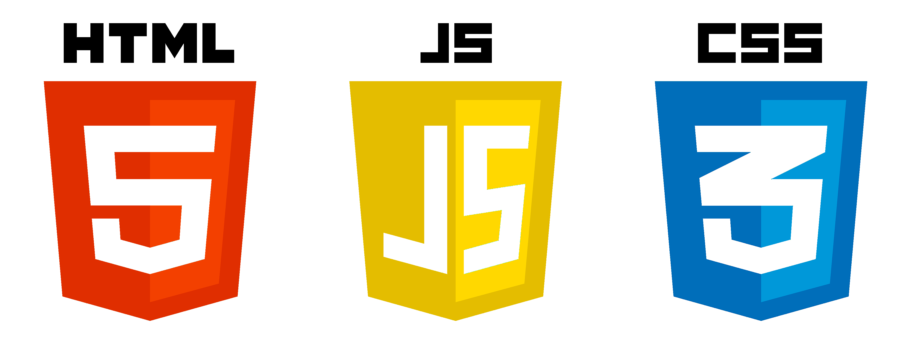

## Место

### В этом спринте начала работу над сервисом Mesto: интерактивной страницей, куда можно добавлять фотографии, удалять их и ставить лайки.

### В проекте была организована файловая структура по БЭМ, применялась адаптивная верстка, а также были затронуты основы JavaScript. Технологии, которые применялись при создании проекта: HTML, CSS и JavaScript.

#### ССылка на страницу проекта [https://jamnovaolya.github.io/mesto/]
